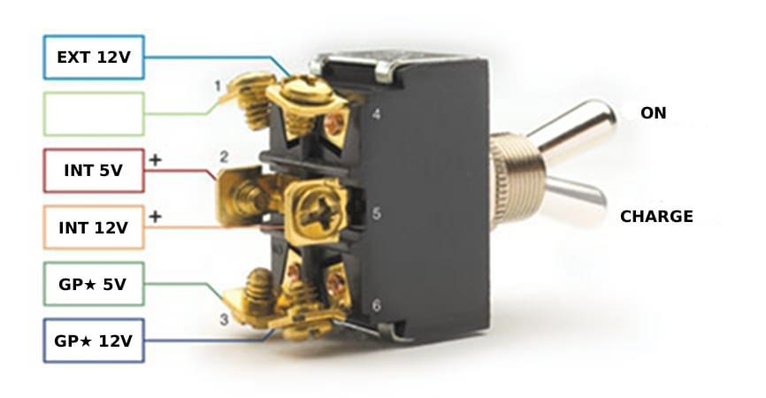

# GP⭐️ / Other Power Isolation Circuit (12V + 5V)

## WARNING

This guide represents a theoretical process based onnthe below
diagram.  The author has not implemented this in the real
world.

YOU HAVE BEEN WARNED

## Parts

For this circuit you will need:

- An On/On DPDT switch (this is the typical DPDT type)
  
  All of your power is going to go through this switch so you may want to get a "beefier" one, perhaps with screw terminals as shown in the switch diagram.

- A 12V DC barrel jack (female)
  
  You will plug the battery charger into this jack when you want to charge the internal battery.
  You can purchase pre-wired jacks which will make this easier for you.

- A 12V DC plug (male)
  
  You will plug this into the internal battery's 12V jack.
  When the switch is in the "On" position, this will connect the battery to the GP⭐️ 12V electronics.
  When it is in the "Charge" position, this will connect the battery to the charger, through the charge port.
  This can also be purchased pre-wired.

- A USB-A plug (male)
  
  You will plug this into the internal battery's 5V USB port.
  When the switch is in the "On" position, it will connect the battery to the GP⭐️ 5V electronics.
  This can of course be purchased pre-wired.

- A JST-XH connector (female although it plugs into a "port" on the pack board)

  You will plug this into the port on the GP⭐️ pack board.
  The easiest way to obtain this part and the above USB-A plug
  is just to cut the included cable in two.

- A length of 18-20g black wire and a length of 18-20g red wire
  long enough to run between your switch and the GP⭐️ pack board. 

- If using pre-wired cables: Some way to color code 5 different red wires.

  For example, 4 (non-black) colors of electrical tape.
  5 (non-black) markers and an appropriate way to tape paper
  colored with them to thin wires.

- If creating your own cables: 4 (non-black) colors of
  18g (20g is probably ok too) wire.

## Instructions

### 12V Barrel Jack

Leave the positive wire as just red if using pre-wired components.

Connect the red wire to the top right terminal of your
switch (labelled 4 in the diagram).

Leave the black wire loose for the moment.

### 12V Plug

Color code the red wire with your first color, for example yellow.

Connect this color coded "yellow" wire to the middle right terminal
of your switch (labelled 5 in the diagram).

Leave the black wire loose for the moment.

### USB-A Plug

Color code the red wire with your second color, for example green.

Connect this color coded "green" wire to the middle left terminal
of your switch (labelled 2 in the diagram).

Leave the black wire loose for the moment.

### JST-XH Connector

Color code the red wire with your third color, for example blue.

Connect this color coded "blue" wire to the bottom left terminal
of your switch (labelled 3 in the diagram).

Leave the black wire loose for the moment.

### Red Wire Length

For the red wire, color code with your fourth color, for example white.

Connect this color coded "white" wire to the bottom rigjt terminal
of your switch (labelled 6 in the diagram).

## Black Wires

All of the black wires from all of the cables and the
length of black wire need to be connected together.

The easiest way to do this, in my opinion, is to use a wire nut.

I do not know the proper size/color to use as I have not
implemented this circuit.

